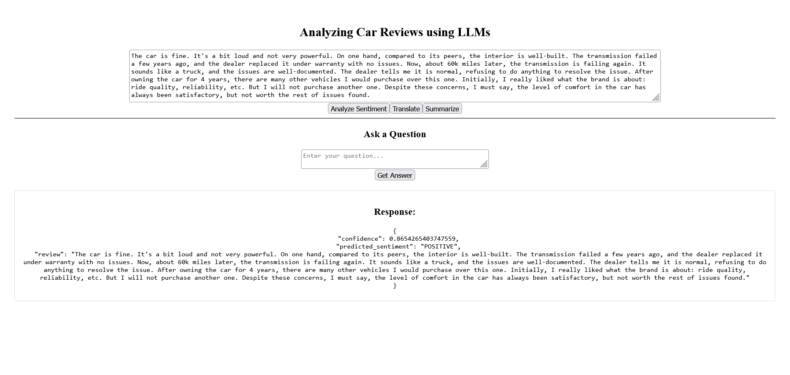

# 🚗 Analyzing Car Reviews with LLMs

## 📌 Project Overview
This project explores the use of **Large Language Models (LLMs)** for analyzing car reviews. It supports **real-time sentiment classification, translation, extractive question answering, and summarization** through a web-based interface.

## 🎯 Objectives
1. **Sentiment Analysis:** Classify reviews as **positive** or **negative** and generate **confidence score**.
2. **Translation:** Convert English reviews to Spanish.
3. **Extractive QA:** Use a Question Answering (QA) model to extract relevant details from reviews.
4. **Summarization:** Generate concise summaries of car reviews.
5. **Real-time Review Analysis:** Implemented a **Flask API** with **Ngrok** for deployment, enabling a **React frontend** to provide real-time analysis.

## 🛠️ Setup & Installation
### 🔹 Prerequisites
Ensure you have Google Colab account.
Additionally, install **NodeJS** and **Vite** for the React frontend.

Use below command to create a new vite react project using **CLI**:
```bash
npm create vite@latest my-project --template react
cd my-project
npm install
```
After this just replace App.jsx file in src folder of my-project with **App.jsx** file of this repo

**Note:** If you don't want to create a new project you can directly use frontend directory in the repo and start the React App.


### 🔹 Running the Backend (Flask API)
Ensure you have an **Ngrok authtoken** and **Hugging Face access token**. Then, run the **script.ipynb** in Google Colab Notebook.


### 🔹 Running the Frontend (React)
Replace the existing URL in the **App.jsx** with your ngrok URL given in Google Colab Notebook.

Start the React app:

```bash
npm run dev
```

## 📊 Model Details
The following pre-trained models are used for different tasks:

| Task | Model Used |
|------|-----------|
| **Sentiment Analysis** | `distilbert-base-uncased-finetuned-sst-2-english` |
| **Translation** | `Helsinki-NLP/opus-mt-en-es` |
| **Extractive QA** | `deepset/minilm-uncased-squad2` |
| **Summarization** | `cnicu/t5-small-booksum` |

## 🌐 Real-Time Review Analysis
- Users enter a **review** in the text box.
- Clicking respective buttons provides:
  - **Sentiment Analysis** result.
  - **Spanish Translation** of the review.
  - **Summarization** of the review.
- For **QA**, users enter a **question** and a **review**, then get the extracted answer.

## Preview:


## 🔗 Future Enhancements
- **Fine-tuning models** for better accuracy on car reviews.
- Expanding support for **multiple languages**.

## 📜 License
This project is licensed under the **MIT License**.

---

🚀 **Contributions are welcome!** If you find this useful, consider giving it a ⭐ on GitHub!

